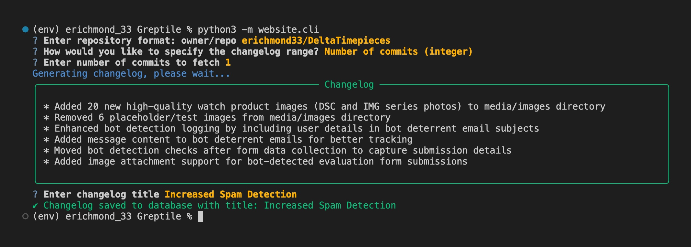
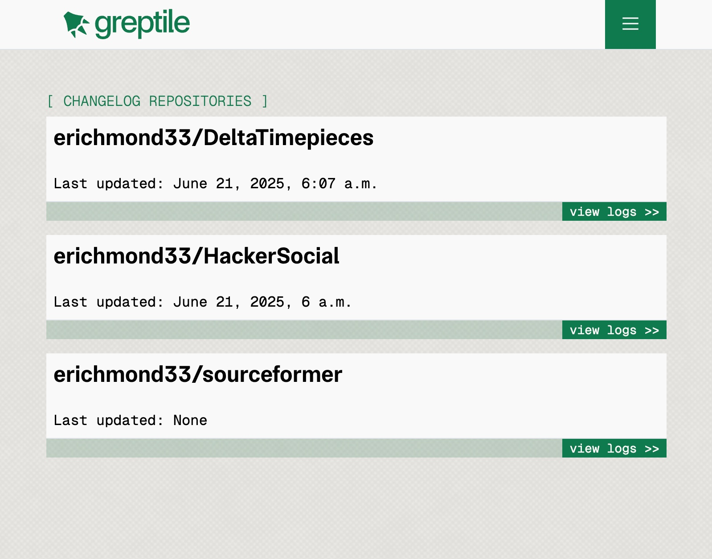
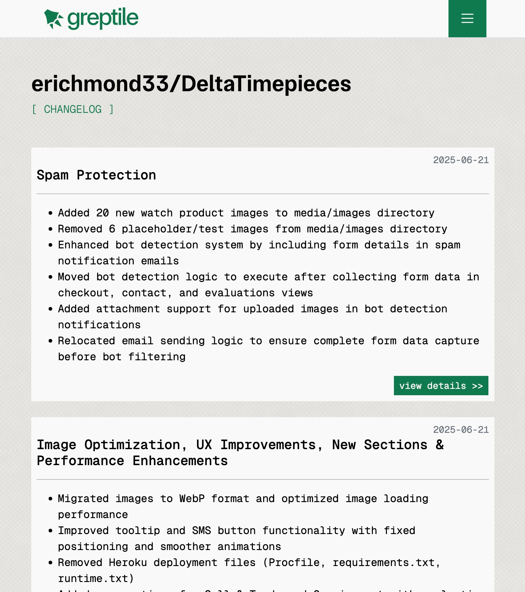

# Design Decisions

### Technical Foundation

I started with a fresh Django project. Since the tool consists of both a CLI and a web interface, I integrated the CLI directly into the Django app. This enables easy database sharing between the command-line changelog generator and the web interface.

Yes, I of course used LLMs to help make this. I'm basically using this to save keystrokes and help me interface with libraries and APIs I haven't used before.

### CLI Design

Having built many CLI tools for personal use, I understand what makes them usable. This changelog generator takes users through three inputs: the repo, commit ranges by number or date, and finally the changelog title. The process is straightforward: gather relevant GitHub commits, extract their differences, and use that context in the LLM prompt (or Greptile API call in this case) to generate the changelogs. This is then saved to the database to be displayed.



### Web Design

This simple web app only has two pages: 1. the main page, which consists of each owner/repo that a changelog is generated for, sorted by the most recent change. Clicking on one of these brings you to the changelog page for that specific repo, where each changelog entry is displayed, including the title, the log, and its creation date. Not too complex.

The styling is aimed to align with the Greptile brand. I enjoy the challenge of adapting design languages from various brands. Of course, I would probably change this a bunch the more time I spent working on it – unlike back-end functionality that has clear functionality, front-end design is very much iterative and constantly improving.




# Setup

```zsh

# Clone the repository

git clone https://github.com/erichmond33/greptile-interview.git

cd greptile-interview

# Activate the env (Mac) & install packages

. env/bin/activate

# Add your Github and Greptile keys to website/keys.env

touch website/keys.env

echo "GITHUB_TOKEN=your_github_token_here" >> website/keys.env
echo "GREPTILE_API_KEY=your_greptile_api_key_here" >> website/keys.env

```

# Run the website

```zsh

# Start localhost (ctrl + c to quit)

python3 manage.py runserver

```

# Use the command line changelog generator

```zsh

# Use the CLI tool

python3 -m website.cli

```